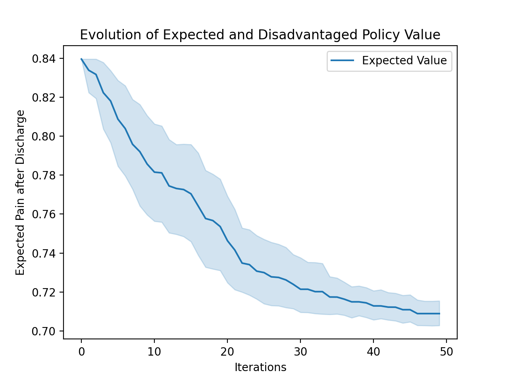

# StAn-MC: A Stochastic Anytime Algorithm for **M**orally **C**onsequential C-SSPs

## Details

Authors: Charles Evans, Sylvie Thiebaux (ANU)

Contact email: u6942700@anu.edu.au

## Contents

This repo contains the experimental setup used to generate the empirical results in my report, "What We Owe to Each Episode: Stochastic Policies in Morally Consequential Constrained SSPs." It implements the StAn-MC algorithm presented in the report, and demonstrates its ability to produce ethically acceptable stochastic policies in a medically-themed example of a morally consequential C-SSP. The repo's contents are as follows:

- `mc_cssp.py` is the main runnable script for generating example policies and plotting the results presented in the report.
- `env/`
    - `mc_cssp_env.py` is an abstract class definition for a morally consequential C-SSP
    - `medic_env.py` extends `mc_cssp_env.py` to define the specific C-SSP we work with (the 'autonomous medic' environment)
- `stan_MC/`
    - `stan_main.py` implements the main body of the StAn-MC algorithm.
    - `stan_mc_cssp_solution.py` is a class definition for a stochastic policy object, as it is defined in the context of StAn-MC.
    - `det_ssp_solver.py` implements a well-known (Dolgov & Durfee 2005) Mixed Integer Program for finding the optimal deterministic policy for a C-SSP (used to compute an initial acceptable policy for StAn-MC.
    - `ssp_random_walk.py` generates batches of random deterministic policies for a C-SSP as well as their expected cost vectors. Used by StAn-MC at each improvement iteration to sample a new population of deterministic policies.
    - `augmented_rmp.py` extends the C-SSP column generation Reduced Master Problem from (Geißer et al. 2020) to find the optimal feasible distribution over a set of deterministic policies, by adding additional 'moral acceptability' constraints (more info. in code documentation and report.

## Running Instructions

The implementation has been done in Python 3, and no compatibility is guaranteed with Python 2.

As a precursor, the following python packages may need to be installed (if they are not already):
- `matplotlib`
- `numpy`
- `pandas`
- `seaborn`
- `gurobipy`
- `scikit-decide`
    - `simplejson` as a sub-dependency of skdecide

StAn-MC can then be used to solve a C-SSP instance and have the results plotted as a lineplot of the various performance metrics over number of policy mprovement iterations. To do, run the following command from the root of the repository:

`python3 mc_cssp.py [--instance INSTANCE] [--iterations ITERATIONS] [--sample_size SAMPLE_SIZE] [--repetitions REPETITIONS] [--bound_wcv WCV_BOUND] [--bound_ewd EWD_BOUND] [--bound_cvar CVAR_BOUND] [--tradeoff_wcv WCV_TRADEOFF_RATE] [--tradeoff_cvar CVAR_TRADEOFF_RATE]`
- Algorithm/Solver Parameters:
    - `INSTANCE` is the name of the c-ssp to be solved. Currently, only `medic_small` is a valid option. Defaults to `medic_small` if parameter not specified.
    - `ITERATIONS` is the number of improvement iterations StAn-MC will attempt on its initial policy. Must be a positive `int`. Defaults to `50`.
    - `SAMPLE_SIZE` is the batch size of determinstic candidate policies sampled at each improvement iteration. Must be a positive `int`. Defaults to `20`.
    - `REPETITIONS` is the number of times the C-SSP will be solved before termination. Multiple consecutive solves are used to define and plot a confidence interval on the results, since StAn-MC is a stochastic algorithm. Must be a positive `int`. Defaults to `20`.
- Acceptability Constraint Parameters:
    - `WCV_Bound` is the upper bound on Worst-Case expected Value of any deterministic policy included in the stochastic policy's distribution. Referred to as `h` in the report. Defaults to `None`, meaning that the constraint will not be enforced.
    - `EWD_Bound` is the upper bound on the difference between the expected value of the stochastic policy and the worst-case expected value of any deterministic policy included in the stochastic policy's distribution; i.e. the 'Expected-Worst Difference'. Referred to as `h'` in the report. Defaults to `None`, meaning that the constraint will not be enforced.
    - `WCV_TRADEOFF_RATE` is the weighting given to the increase in worst-case value from one StAn-MC iteration to the next, relative to the decrease in expected value. This is used to constrain the weight-multiplied worst-case value increase not to exceed the expected value decrease from one iteration to the next. Referred to as `θ` in the report. Defaults to `None`, meaning that the constraint will not be enforced.
    - `CVAR_TRADEOFF_RATE` is the weighting given to the increase in Conditional Value-at-Risk (CVaR) from one StAn-MC iteration to the next, relative to the decrease in expected value. This is used to constrain the weight-multiplied CVaR increase not to exceed the expected value decrease from one iteration to the next. Referred to as `θ'` in the report. Defaults to `None`, meaning that the constraint will not be enforced.

We recommend experimenting with enforcing one or a couple of constraints at once (e.g. one bound-type and one tradeoff-type, rather than all at once.

### Output

Since policies are not particularly human-readable, we do not output them as part of the `mc_ccsp.py` script (if interested, `stan_MC/stan_main.py#solve_cssp` would output the information you are after).

Instead, we produce plots of the evolution of the expected value of the best current solution found by StAn-MC over the number of iterations taken for it to be found. Assuming `REPETITIONS` > 1, this will be a lineplot of the mean expected value achieved at each iteration across all of the repeated solves. There will also be a confidence interval for each iteration, displayed as a shaded region around the lineplot.

For example, running `python3 mc_cssp.py` with no explicit arguments will solve `medic_small` 20 times with no moral acceptability constraints, and should output a plot similar to the following:

If constraints are enforced, the metrics/measured being used to enforce those constraints will also be plotted in the same format. So for example, if we enforce constraints which invoke worst-case value and CVaR, e.g. `python3 mc_cssp.py --tradeoff_cvar 0.5 --bound_wcv 1.5`, the evolution of worst-case value and CVaR over time will be plotted as well, to allow you to verify that the constraints are having the desired effect:

## 

For more information on the experimental context and setup, please see the report and the implementation docstrings.
